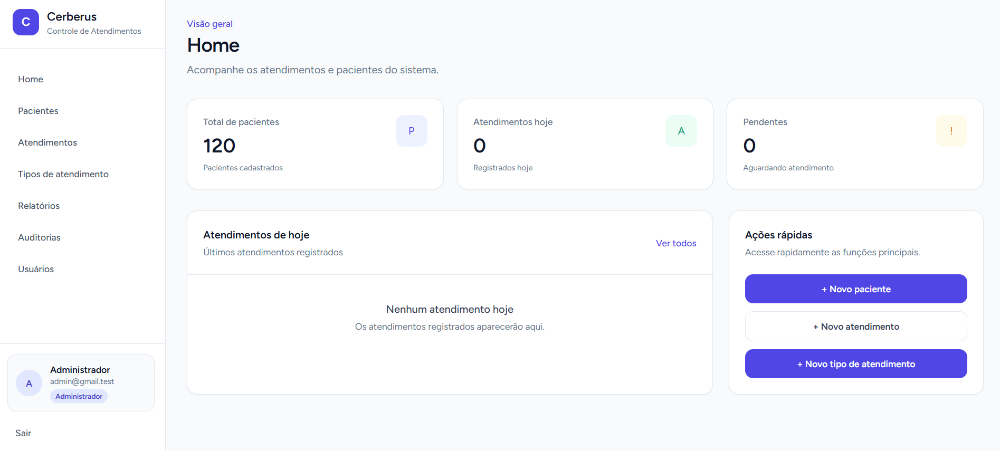
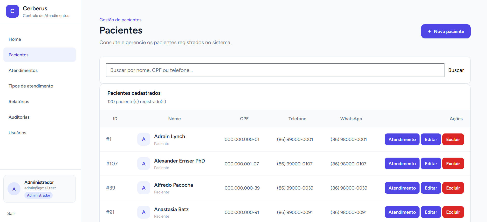
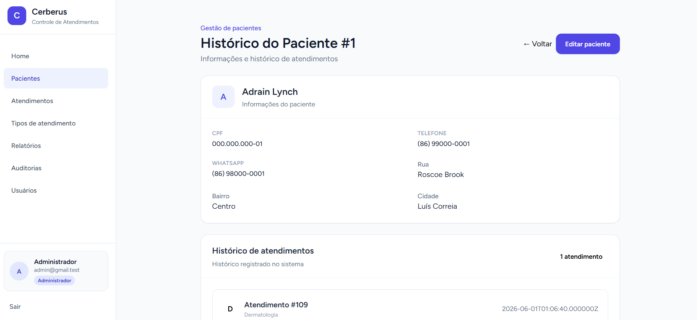
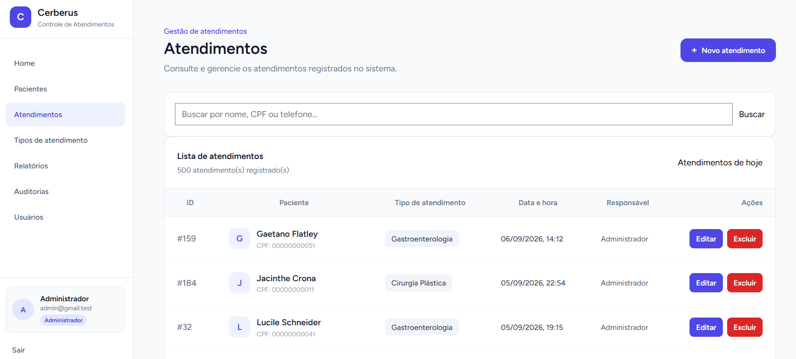
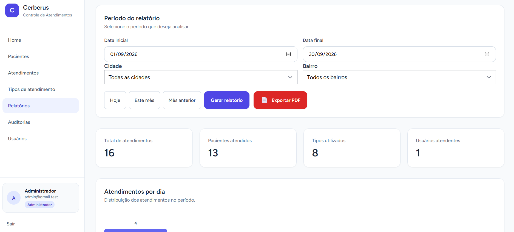
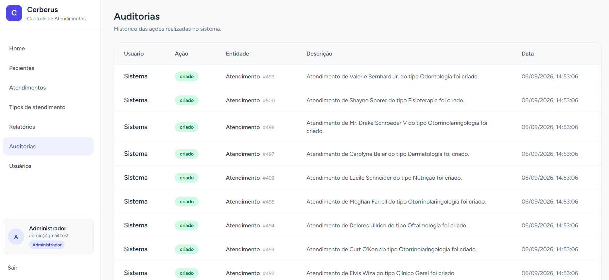

# 🏥 Sistema de Controle de Atendimentos

Sistema web desenvolvido para gerenciamento de pacientes e atendimentos, permitindo centralizar informações, registrar atendimentos, consultar históricos e gerar relatórios para acompanhamento da demanda.

O projeto foi desenvolvido utilizando **Laravel, Vue.js, Inertia.js, MySQL e Tailwind CSS**, com foco em organização, segurança, rastreabilidade e facilidade de uso.

---

## 📌 Sobre o projeto

O Sistema de Controle de Atendimentos foi desenvolvido com o objetivo de centralizar o gerenciamento de pacientes e seus atendimentos em uma única aplicação.

A solução busca reduzir a dependência de registros manuais, planilhas e informações descentralizadas, proporcionando um fluxo mais organizado para cadastro, atendimento, registro e consulta.

### Fluxo principal

Cadastrar
    ↓
Atender
    ↓
Registrar
    ↓
Consultar

## 🎯 Objetivos
Centralizar informações dos pacientes;
Facilitar o registro de atendimentos;
Permitir consulta do histórico dos pacientes;
Organizar os tipos de atendimento;
Controlar usuários e permissões;
Gerar relatórios e indicadores;
Registrar ações importantes realizadas no sistema;
Melhorar a organização e rastreabilidade das informações.

## 🖥️ Screenshots

### Dashboard

---

### Pacientes

---

### Ficha do paciente

---

### Atendimentos

---

### Relatórios

---

### Auditoria

## 📚 Documentação

A documentação detalhada do projeto está disponível na pasta `docs`.

### 📄 Documentação do sistema

[Visualizar documentação](docs/Documentacao_Sistema_Controle_Atendimentos.docx)

### 🎤 Apresentação do projeto

[Visualizar apresentação](docs/Controle%20de%20Atendimento%20Apresentação.pdf)

## ⚙️ Funcionalidades

## 👤 Pacientes
Cadastro de pacientes;
Edição de pacientes;
Consulta de pacientes;
Busca por nome;
Busca por CPF;
Busca por telefone;
Busca por WhatsApp;
Validação matemática de CPF;
Prevenção de CPF duplicado;
Cadastro de endereço;
Rua, bairro e cidade separados;
Consulta do histórico de atendimentos;
Exclusão lógica utilizando Soft Delete.

## 🏥 Atendimentos
Cadastro de atendimentos;
Seleção do paciente;
Seleção do tipo de atendimento;
Definição de data e hora;
Registro de observações;
Registro de encaminhamentos;
Identificação do usuário responsável;
Edição de atendimentos;
Consulta de atendimentos;
Busca por paciente;
Busca por CPF;
Busca por tipo de atendimento;
Busca por observações;
Busca por encaminhamentos;
Busca por data.

## 📋 Tipos de atendimento

O sistema permite cadastrar, editar, consultar e remover logicamente os tipos de atendimento.

Exemplos:

Odontologia;
Cardiologia;
Oftalmologia;
Dermatologia;
Clínico Geral;
Fisioterapia;
Nutrição;
Gastroenterologia;
Cirurgia Plástica;
Otorrinolaringologia.

## 👥 Usuários

O sistema possui gerenciamento de usuários com controle de acesso.

Administrador

Possui acesso às funcionalidades administrativas, como:

gerenciamento de usuários;
relatórios;
auditoria;
gerenciamento dos demais recursos do sistema.
Usuário comum

Possui acesso às funcionalidades operacionais necessárias para realização dos atendimentos, sem acesso às áreas administrativas restritas.

## 📊 Dashboard e indicadores

O dashboard apresenta informações gerais do sistema para facilitar o acompanhamento da utilização da aplicação.

Entre os dados apresentados estão:

quantidade de pacientes;
atendimentos realizados;
informações relacionadas à demanda;
resumo dos tipos de atendimento.

## 📈 Relatórios

O sistema possui um módulo de relatórios para análise dos atendimentos.

Indicadores
Total de atendimentos;
Pacientes atendidos;
Tipos de atendimento utilizados;
Usuários responsáveis pelos atendimentos.
Distribuição dos atendimentos
Atendimentos por tipo;
Atendimentos por usuário;
Atendimentos por dia;
Atendimentos por cidade;
Atendimentos por bairro.
Filtros

Os relatórios podem ser filtrados por:

Data inicial;
Data final;
Cidade;
Bairro.
Exportação

Os relatórios podem ser exportados em PDF.

## 🔐 Segurança

A aplicação possui mecanismos de autenticação e autorização para proteger as funcionalidades do sistema.

Autenticação

As áreas protegidas da aplicação exigem que o usuário esteja autenticado.

Autorização

O projeto utiliza Middleware e Policies para controlar o acesso.

Autenticação
     ↓
Quem é o usuário?

     ↓

Autorização
     ↓
O que esse usuário pode fazer?

As áreas administrativas são protegidas por middleware específico.

As Policies são utilizadas para controlar ações relacionadas aos recursos da aplicação.

## 🗑️ Soft Delete

Algumas entidades utilizam Soft Delete.

Ao invés de excluir imediatamente o registro do banco de dados, o sistema registra a data de exclusão.

Isso permite preservar os dados e possibilita futuras funcionalidades de recuperação.

## 📝 Auditoria

O sistema possui um mecanismo de auditoria para registrar ações importantes realizadas pelos usuários.

São armazenadas informações como:

usuário responsável;
ação realizada;
entidade afetada;
identificador da entidade;
descrição;
data e hora.

Exemplo:

Administrador
      ↓
Atualizou paciente
      ↓
Paciente #25
      ↓
Data e hora da operação

A auditoria utiliza Observers para registrar automaticamente determinadas operações realizadas nos Models.

Também são utilizados Events e Listeners para registrar eventos específicos, como a geração de relatórios.

## 🧩 Arquitetura

A aplicação utiliza a estrutura tradicional do Laravel, separando responsabilidades entre Controllers, Models, Policies, Middleware, Observers, Events e Listeners.

                    ┌─────────────────────┐
                    │       Vue.js        │
                    │      Frontend       │
                    └──────────┬──────────┘
                               │
                               │ Inertia.js
                               ↓
                    ┌─────────────────────┐
                    │      Laravel        │
                    │      Backend        │
                    └──────────┬──────────┘
                               │
              ┌────────────────┼────────────────┐
              ↓                ↓                ↓
        Controllers         Policies         Middleware
              │
              ↓
           Models
              │
        ┌─────┴──────┐
        ↓            ↓
    Observers      Events
        │            │
        ↓            ↓
    Auditoria     Listeners
                     │
                     ↓
                   MySQL
                   
## 🧠 Conceitos e padrões utilizados

O projeto utiliza recursos do Laravel e conceitos de Design Patterns para resolver problemas reais da aplicação.

Observer

Utilizado para registrar automaticamente ações realizadas sobre entidades.

Model
  ↓
Observer
  ↓
Auditoria
Event / Listener

Utilizado para desacoplar determinadas ações do fluxo principal.

Exemplo:

Relatório gerado
       ↓
     Event
       ↓
    Listener
       ↓
   Auditoria
Policy

Utilizada para controlar autorização de ações específicas sobre recursos.

Middleware

Utilizado para controlar o acesso a áreas da aplicação.

## 🗄️ Banco de dados

O banco de dados é gerenciado através das Migrations do Laravel.

Principais entidades:

users
  │
  ├───────────────┐
  │               │
  ↓               ↓
atendimentos   auditorias
  │
  ├──────────────→ pacientes
  │
  └──────────────→ tipos_atendimento
Principais relacionamentos
Paciente
    │
    └── possui vários atendimentos

Atendimento
    ├── pertence a um paciente
    ├── pertence a um tipo de atendimento
    └── pertence a um usuário

Tipo de Atendimento
    └── possui vários atendimentos

Usuário
    ├── realiza atendimentos
    └── possui ações registradas na auditoria
    
## 🧪 Testes

O projeto possui testes automatizados para validar comportamentos importantes da aplicação.

Entre os cenários estão:

autorização de usuários;
acesso administrativo;
regras relacionadas aos recursos;
relatórios;
auditoria.

Os testes utilizam um banco de dados separado do ambiente de desenvolvimento.

Para executar os testes:

php artisan test

## 🛠️ Tecnologias utilizadas
Backend
PHP 8.4+
Laravel
Eloquent ORM
MySQL
Composer
Frontend
Vue.js 3
Inertia.js
JavaScript
Tailwind CSS
DaisyUI
Vite
Autenticação e autorização
Laravel Breeze
Middleware
Policies
Ziggy
Arquitetura e recursos
Eloquent ORM
Migrations
Seeders
Observers
Events
Listeners
Soft Delete
Testes
Pest / PHPUnit
Banco de dados separado para testes
Versionamento
Git
GitHub

## 📁 Estrutura do projeto
sistema_atendimento_cerberus/
│
├── app/
│   ├── Events/
│   ├── Http/
│   │   ├── Controllers/
│   │   ├── Middleware/
│   │   └── Requests/
│   ├── Listeners/
│   ├── Models/
│   ├── Observers/
│   └── Policies/
│
├── database/
│   ├── factories/
│   ├── migrations/
│   └── seeders/
│
├── docs/
│   ├── screenshots/
│   │   ├── atendimentos.png
│   │   ├── auditoria.png
│   │   ├── dashboard.png
│   │   ├── ficha-paciente.png
│   │   ├── pacientes.png
│   │   └── relatorios.png
│   │
│   ├── Controle de Atendimento Apresentação.pdf
│   └── Documentacao_Sistema_Controle_Atendimentos.docx
│
├── resources/
│   ├── css/
│   ├── js/
│   │   ├── Components/
│   │   ├── Layout/
│   │   └── Pages/
│   └── views/
│
├── routes/
│   ├── auth.php
│   └── web.php
│
├── tests/
│   ├── Feature/
│   └── Unit/
│
├── .env.example
├── composer.json
├── package.json
├── vite.config.js
└── README.md

## 🚀 Instalação
Requisitos
PHP 8.4+
Composer
Node.js
npm
MySQL
Git
1. Clonar o projeto
git clone https://github.com/MarcosVCarvalho/sistema_atendimento_cerberus.git
cd sistema_atendimento_cerberus
2. Instalar dependências PHP
composer install
3. Instalar dependências JavaScript
npm install
4. Configurar o ambiente

Copie o arquivo .env.example:

Linux / macOS
cp .env.example .env
Windows PowerShell
Copy-Item .env.example .env

Configure as informações do banco de dados no .env.

Exemplo:

DB_CONNECTION=mysql
DB_HOST=127.0.0.1
DB_PORT=3306
DB_DATABASE=laravel
DB_USERNAME=root
DB_PASSWORD=
5. Gerar a chave da aplicação
php artisan key:generate
6. Executar migrations e seeders
php artisan migrate --seed
7. Iniciar o Laravel
php artisan serve
8. Iniciar o Vite

Em outro terminal:

npm run dev

A aplicação estará disponível em:

http://127.0.0.1:8000
🔑 Usuário de demonstração

Para o ambiente de demonstração:

E-mail:
admin@prefeitura.test

Senha:
password

⚠️ Essas credenciais são destinadas somente ao ambiente de desenvolvimento/demonstração. Em produção, devem ser substituídas.

## 📈 Evolução do projeto

O projeto começou com o objetivo de atender às funcionalidades básicas de cadastro e controle de atendimentos.

Durante o desenvolvimento, foram adicionados recursos para tornar a aplicação mais completa.

CRUD
 ↓
Autenticação
 ↓
Controle de permissões
 ↓
Policies
 ↓
Soft Delete
 ↓
Auditoria
 ↓
Observers
 ↓
Relatórios
 ↓
Filtros avançados
 ↓
Exportação PDF
 ↓
Testes automatizados

## 🔮 Possíveis evoluções futuras

Entre as possibilidades de evolução estão:

Exportação para Excel/CSV;
Dashboard com indicadores mais avançados;
Recuperação de registros excluídos;
Notificações;
Histórico detalhado de alterações;
Controle de status do atendimento;
Filas de atendimento;
API para integração com outros sistemas;
Controle de unidades de atendimento;
CI/CD utilizando GitHub Actions.
📌 Considerações técnicas
Laravel

Responsável pelas regras de negócio, persistência, autenticação, autorização e estrutura principal do backend.

Vue.js

Responsável pela construção da interface dinâmica da aplicação.

Inertia.js

Permite utilizar Vue.js no frontend mantendo a estrutura de rotas e Controllers do Laravel.

Eloquent

Responsável pela interação com o banco de dados e pelos relacionamentos entre as entidades.

Policies e Middleware

Utilizados conjuntamente para separar controle de acesso geral de autorização específica dos recursos.

Observers e Events

Utilizados para desacoplar comportamentos secundários, principalmente relacionados à auditoria.

## 👨‍💻 Autor

Desenvolvido por Marcos V. Carvalho.

Projeto desenvolvido para fins de estudo, portfólio e demonstração de conhecimentos em desenvolvimento web utilizando Laravel e Vue.js.

## 📄 Licença

Este projeto foi desenvolvido para fins educacionais e de portfólio.
